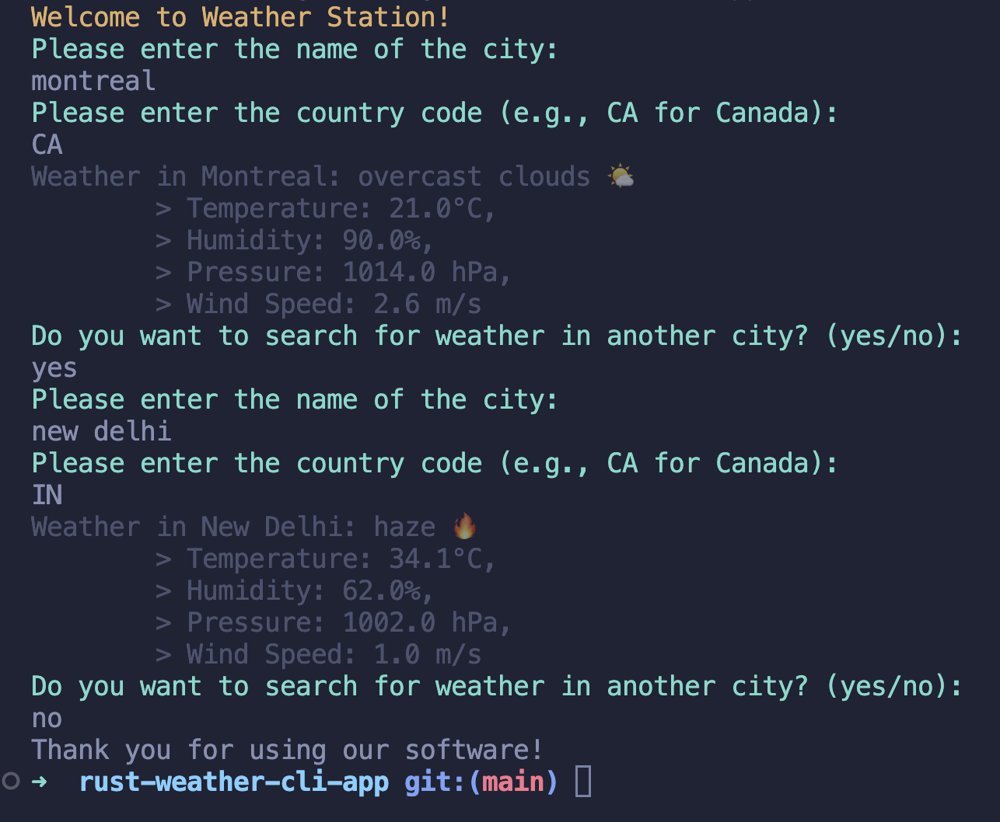

# rust-weather-cli-app

A simple and cool 🌦️ CLI app built with Rust that fetches real-time weather using the OpenWeatherMap API.

Check the weather right from your terminal!

## App Preview


## Prerequisites
- Rust: Make sure Rust is installed. You can install it from [rust-lang.org](https://www.rust-lang.org/).
- Cargo: Rust’s package manager, which comes with the Rust installation.
- OpenWeatherMap API Key: Get your API key at [OpenWeatherMap](https://openweathermap.org).

## Getting Started
1- **Clone the Repository :**
```bash
git clone https://github.com/jaunewick/rust-weather-cli-app.git
cd rust-weather-cli-app
```
2- **Set Up Environment Variables :**
- Create a .env file in the root of the project.
- Add your OpenWeatherMap API key:
```md
API_KEY=<your_openweathermap_api_key>
```

3- **Build the Application :**

Compile the Rust code:
```bash
cargo build
```

4- **Run the App :**

Execute the compiled binary:
```bash
cargo run
```

5- **Enjoy using my software! :)**
